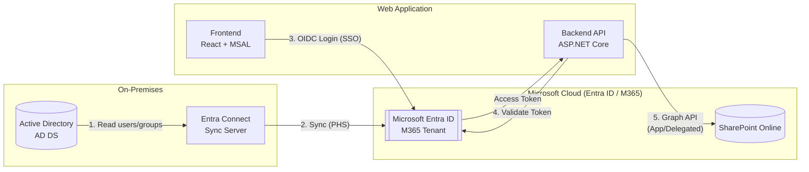
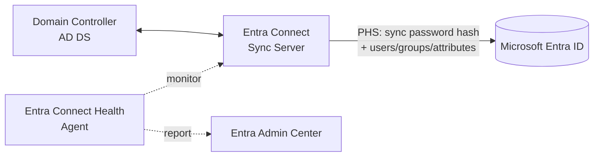
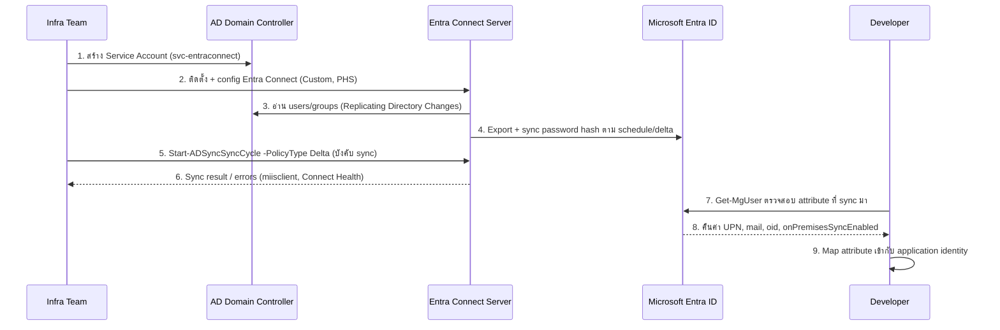
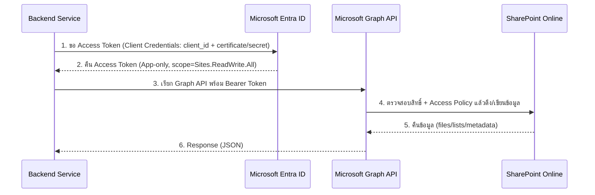
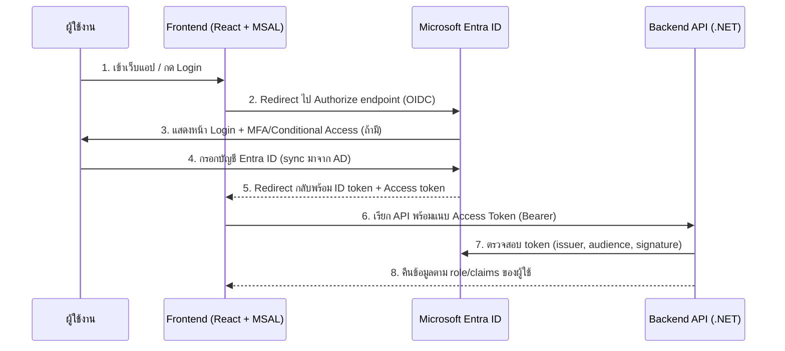

# Requirement Document: AD Sync, SharePoint Online Integration และ Web Application SSO

## 1. วัตถุประสงค์ (Objective)
เอกสารนี้สรุป requirement และแนวทางการดำเนินงาน (implementation approach) สำหรับ 3 หัวข้อหลัก โดยแบ่งความรับผิดชอบระหว่างทีม **Infra** และทีม **Developer**

1. เชื่อมต่อ Active Directory (On-Premises) กับ Microsoft Entra ID (M365) แบบ Sync
2. เชื่อมต่อกับ SharePoint Online
3. Web Application Login แบบ SSO (Single Sign-On)

### ภาพรวมสถาปัตยกรรม (Overall Architecture)



---

## 2. เชื่อมต่อ AD On-Premises Sync กับ Entra ID (M365)

### 2.1 เป้าหมาย
Sync บัญชีผู้ใช้ (users), กลุ่ม (groups) และ attribute ต่าง ๆ จาก On-Premises Active Directory (AD DS) ไปยัง Microsoft Entra ID เพื่อให้ผู้ใช้ใช้บัญชีเดียว (Identity) ทั้งระบบภายในองค์กรและระบบ Cloud/M365

### 2.2 แนวทางดำเนินการ (Approach)
- ใช้ **Microsoft Entra Connect (Entra Connect Sync)** ติดตั้งบน Server ภายในองค์กร (on-premises) เพื่อทำ Directory Synchronization
- เลือกรูปแบบ Authentication ที่เหมาะสม:
  - **Password Hash Synchronization (PHS)** — ง่ายต่อการดูแล เหมาะกับองค์กรส่วนใหญ่
  - **Pass-through Authentication (PTA)** — ไม่ sync password hash แต่ต้อง maintain agent
  - **Federation (AD FS)** — สำหรับ requirement เฉพาะ เช่น smart card, on-prem MFA
- เปิดใช้งาน **Seamless SSO** (ถ้าต้องการให้ user ใน domain-joined device ไม่ต้อง login ซ้ำ)
- กำหนด **OU/Scope filtering** ว่าจะ sync users/groups OU ใดบ้าง
- วางแผน **Attribute mapping** (เช่น UPN, mail, proxyAddresses)
- ตั้งค่า **Sync schedule** (default 30 นาที) และ monitor ผ่าน Entra Connect Health



### 2.3 บทบาทของแต่ละทีม

| ทีม | หน้าที่ |
|---|---|
| **Infra** | - จัดเตรียม Server (Windows Server) สำหรับติดตั้ง Entra Connect<br>- เปิด Network/Firewall rule (outbound 443/80 ไปยัง Microsoft 365 endpoints)<br>- สร้าง Service Account สำหรับ Directory Sync (DS account) และ Enterprise Admin ชั่วคราวสำหรับ config<br>- ติดตั้งและ config Entra Connect (เลือก sign-in method, filtering OU, staging server สำรอง)<br>- Monitor sync ผ่าน Entra Connect Health, ตรวจสอบ sync errors (duplicate attribute, UPN mismatch)<br>- วาง DR/HA plan (staging mode server) |
| **Developer** | - ตรวจสอบว่า attribute ที่ sync มา (UPN, mail, employeeId ฯลฯ) ตรงกับที่ระบบ/แอปพลิเคชันต้องใช้อ้างอิง<br>- ปรับ mapping field ใน application ที่ผูกกับ user identity (เช่น username, email) ให้รองรับ UPN จาก Entra ID<br>- ทดสอบ flow login ของแอปหลัง user ถูก sync เข้า Entra ID แล้ว |

### 2.4 Step-by-Step: ติดตั้งและตั้งค่า Entra Connect Sync (PHS)

> อ้างอิงสภาพแวดล้อม: มี Windows Server AD DS/Domain Controller อยู่แล้ว และมี Microsoft 365/Entra ID tenant พร้อมใช้งานแล้ว ใช้วิธี **Password Hash Synchronization (PHS)**

#### Step 1: เตรียม Server สำหรับติดตั้ง Entra Connect (ทีม Infra)
- ใช้ Windows Server 2019/2022 (แนะนำ **ไม่ติดตั้งบน Domain Controller โดยตรง** ใน production — ใช้ member server แยกต่างหาก)
- Requirement เบื้องต้น: .NET Framework 4.7.2+, TLS 1.2 enabled, join เข้า domain เดียวกับ AD ที่จะ sync
- เปิด Firewall (outbound) ไปยัง Microsoft 365 endpoints ตาม [Microsoft 365 URLs and IP address ranges](https://learn.microsoft.com/microsoft-365/enterprise/urls-and-ip-address-ranges) เช่น `*.msappproxy.net`, `login.microsoftonline.com`, `*.microsoftonline.com` พอร์ต 443/80

```powershell
# ตรวจสอบ TLS 1.2 เปิดใช้งานอยู่ (รันบน server ที่จะติดตั้ง Entra Connect)
Get-ItemProperty -Path 'HKLM:\SYSTEM\CurrentControlSet\Control\SecurityProviders\SCHANNEL\Protocols\TLS 1.2\Client' `
  -Name 'DisabledByDefault' -ErrorAction SilentlyContinue

# ทดสอบว่า resolve และเชื่อมต่อ endpoint ของ Microsoft 365 ได้
Test-NetConnection login.microsoftonline.com -Port 443
```

#### Step 2: สร้าง Service Account ที่จำเป็น (ทีม Infra)
- **AD DS Connector account**: บัญชี AD (ไม่ต้องเป็น Domain Admin) ที่มีสิทธิ์ Replicating Directory Changes เพื่ออ่านข้อมูลจาก AD
- **Entra ID Global Administrator**: ใช้ตอน config ครั้งแรกเท่านั้น (บัญชี cloud-only ของ tenant)

```powershell
# ตัวอย่าง: สร้าง OU และ user account สำหรับ Entra Connect connector บน AD (รันบน Domain Controller)
New-ADOrganizationalUnit -Name "ServiceAccounts" -Path "DC=contoso,DC=com"

New-ADUser -Name "svc-entraconnect" `
  -SamAccountName "svc-entraconnect" `
  -UserPrincipalName "svc-entraconnect@contoso.com" `
  -Path "OU=ServiceAccounts,DC=contoso,DC=com" `
  -AccountPassword (ConvertTo-SecureString "P@ssw0rd-Change-Me!" -AsPlainText -Force) `
  -Enabled $true `
  -PasswordNeverExpires $true
```

#### Step 3: ดาวน์โหลดและติดตั้ง Microsoft Entra Connect Sync (ทีม Infra)
1. ดาวน์โหลดตัวติดตั้งล่าสุดจาก Entra admin center: **Entra Connect > Microsoft Entra Connect Sync > Download**
2. รันตัวติดตั้ง เลือก **Custom installation** (แนะนำ แทน Express) เพื่อกำหนดค่าเองได้ครบถ้วน
3. เลือก Sign-in method = **Password Hash Synchronization**
4. เชื่อมต่อ Entra ID tenant โดย login ด้วย Global Administrator account
5. เชื่อมต่อ AD Forest โดยใส่ AD DS Connector account ที่สร้างไว้
6. กำหนด **Domain/OU filtering** เลือกเฉพาะ OU ที่ต้องการ sync (เช่น เฉพาะ `OU=Users,DC=contoso,DC=com`)
7. กำหนด **Uniquely identifying users** (ปกติใช้ `mS-DS-ConsistencyGuid` เป็น anchor)
8. กำหนด **Filter users and devices** (ถ้าต้องการ sync เฉพาะบาง group)
9. เปิด **Password Hash Synchronization** + (ถ้าต้องการ) **Password writeback**
10. เปิด **Seamless SSO** และ (ถ้าต้องการ) **Auto Health Check**
11. เลือก **Start the synchronization process when configuration completes**

#### Step 4: ตรวจสอบผลการ Sync (ทีม Infra)

```powershell
# รันบน Entra Connect server: ตรวจสอบสถานะ scheduler และรอบ sync ล่าสุด
Import-Module ADSync
Get-ADSyncScheduler

# บังคับให้ sync รอบ delta ทันที (ไม่ต้องรอ schedule 30 นาที)
Start-ADSyncSyncCycle -PolicyType Delta

# ตรวจสอบ errors ล่าสุดจาก sync (ผ่าน Synchronization Service Manager UI: miisclient.exe)
# หรือดูผ่าน Entra admin center > Entra Connect > Health/Errors
```

```powershell
# ฝั่ง Entra ID: ตรวจสอบว่า user ถูก sync เข้ามาแล้ว (ใช้ Microsoft Graph PowerShell)
Connect-MgGraph -Scopes "User.Read.All"
Get-MgUser -Filter "userPrincipalName eq 'user1@contoso.com'" | Select-Object DisplayName, OnPremisesSyncEnabled, OnPremisesImmutableId
```

#### Step 5: Monitor และ Health Check (ทีม Infra)
- ติดตั้ง **Microsoft Entra Connect Health** agent เพื่อ monitor sync errors, performance, และ alert แบบ real-time
- ตรวจสอบ sync error ที่พบบ่อย: duplicate attribute (เช่น `proxyAddresses` ซ้ำ), UPN ที่มี character ไม่รองรับ, object ที่เกิน OU scope
- ตั้งค่า **Staging Mode server** สำรองไว้ (server 2nd instance ที่ config เหมือนกันแต่ไม่ export ออกจริง) เพื่อใช้ตอน production server ล่ม

#### Step 6: ตรวจสอบฝั่ง Application/Developer
```powershell
# ตัวอย่าง: Developer เรียก Microsoft Graph เพื่อดึง attribute ที่ sync มา เพื่อ map เข้ากับระบบ (เช่น employeeId, UPN)
Connect-MgGraph -Scopes "User.Read.All"
Get-MgUser -UserId "user1@contoso.com" `
  -Property "displayName,userPrincipalName,mail,employeeId,onPremisesSamAccountName" |
  Select-Object DisplayName, UserPrincipalName, Mail, EmployeeId, OnPremisesSamAccountName
```
- Developer ควรอ้างอิง **UPN** หรือ **`oid` (object id)** ใน token เป็น unique key แทนการใช้ email/username ตรง ๆ เพราะ email อาจเปลี่ยนได้ แต่ `oid` คงที่ตลอดอายุ object
- ทดสอบ end-to-end: สร้าง test user ใน AD → รอ/บังคับ sync → login เข้าแอป (ทดสอบใน section 4) → ตรวจสอบว่า claim/attribute ที่ได้ตรงตามคาด

### 2.5 Sequence Diagram: ขั้นตอนการ Sync แบบ End-to-End



---

## 3. เชื่อมต่อกับ SharePoint Online

### 3.1 เป้าหมาย
ให้ Web Application หรือ Backend Service สามารถอ่าน/เขียนข้อมูล (files, lists, metadata) บน SharePoint Online ได้อย่างปลอดภัย โดยใช้ identity ที่มาจาก Entra ID

### 3.2 แนวทางดำเนินการ (Approach)
- ใช้ **Microsoft Graph API** เป็นช่องทางหลักในการเชื่อมต่อ (แนะนำแทน SharePoint CSOM/REST แบบเก่า)
- สร้าง **App Registration** ใน Entra ID สำหรับ Service/Application ที่จะเชื่อมต่อ SharePoint
- เลือกรูปแบบ authentication ให้เหมาะกับ use case:
  - **Application permissions (App-only / Client Credentials flow)** — ใช้เมื่อ backend service ต้องเข้าถึงข้อมูลโดยไม่มี user context (เช่น batch job, sync service)
  - **Delegated permissions (On-behalf-of user)** — ใช้เมื่อ action ต้องทำในนามของ user ที่ login อยู่
- กำหนด **API Permissions** ที่จำเป็น เช่น `Sites.Read.All`, `Sites.ReadWrite.All`, `Files.ReadWrite.All` และให้ Admin ทำ **Admin Consent**
- ใช้ **Client Secret หรือ Certificate** สำหรับ Application permissions (แนะนำ Certificate เพื่อความปลอดภัยสูงกว่า)
- พิจารณาจำกัด scope การเข้าถึงเฉพาะ site ที่ต้องใช้งานจริงผ่าน **Application Access Policy** (SharePoint restricted scope) เพื่อลด attack surface



### 3.3 บทบาทของแต่ละทีม

| ทีม | หน้าที่ |
|---|---|
| **Infra** | - สร้างและดูแล App Registration บน Entra ID (Client ID, Tenant ID)<br>- อนุมัติ Admin Consent สำหรับ API permissions ที่ dev ร้องขอ<br>- ตั้งค่า Application Access Policy จำกัด site ที่เข้าถึงได้ (ถ้าองค์กรต้องการ)<br>- ดูแล lifecycle ของ Client Secret/Certificate (rotation, expiry monitoring)<br>- ตรวจสอบ SharePoint site permission/ownership ที่เกี่ยวข้อง |
| **Developer** | - พัฒนาโค้ดเชื่อมต่อ Microsoft Graph SDK (หรือ REST call) พร้อม authentication flow ที่เหมาะสม (MSAL library)<br>- จัดการ token acquisition/caching (Client Credentials flow หรือ On-Behalf-Of flow)<br>- Implement error handling/retry สำหรับ throttling (HTTP 429) ตาม Graph API best practice<br>- เก็บ Client Secret/Certificate อย่างปลอดภัย (เช่น Azure Key Vault) ห้าม hard-code ใน source code<br>- เขียน unit/integration test สำหรับการอ่าน/เขียนข้อมูล SharePoint |

---

## 4. Web Application Login แบบ SSO

### 4.1 เป้าหมาย
ให้ผู้ใช้ล็อกอินเข้า Web Application ด้วยบัญชี Entra ID เดียวกับที่ใช้ในองค์กร (M365) โดยไม่ต้องสร้างบัญชีแยกต่างหาก

### 4.2 แนวทางดำเนินการ (Approach)
- ใช้ Protocol มาตรฐาน **OpenID Connect (OIDC) / OAuth 2.0** (แนะนำสำหรับ web app สมัยใหม่) หรือ **SAML 2.0** (สำหรับระบบ legacy ที่รองรับเฉพาะ SAML)
- สร้าง **App Registration** แยกสำหรับ Web Application ใน Entra ID พร้อมกำหนด:
  - **Redirect URI / Reply URL**
  - **Logout URL**
  - Token configuration (ID token, access token claims ที่ต้องการ เช่น email, groups, roles)
- ฝั่ง Backend/Frontend ใช้ library มาตรฐานในการ implement เช่น:
  - **MSAL (Microsoft Authentication Library)** — สำหรับ SPA/Frontend (React) และ Backend (.NET)
  - ตัวอย่างในโปรเจกต์นี้: Backend เป็น ASP.NET Core (`backend/`) และ Frontend เป็น React + Vite (`frontend/`) — สามารถใช้ `Microsoft.Identity.Web` ฝั่ง Backend และ `@azure/msal-react` ฝั่ง Frontend
- กำหนด **Token validation** ฝั่ง Backend API (validate issuer, audience, signature ผ่าน Entra ID metadata endpoint)
- Implement **Role-Based Access Control (RBAC)** โดย map Entra ID Groups/App Roles กับสิทธิ์การใช้งานในแอป
- เปิดใช้ **Conditional Access / MFA** ตาม policy องค์กร (ฝั่ง Infra กำหนด policy)



### 4.3 บทบาทของแต่ละทีม

| ทีม | หน้าที่ |
|---|---|
| **Infra** | - สร้าง App Registration สำหรับ Web Application (Client ID, Tenant ID, Redirect URI)<br>- กำหนด Conditional Access Policy / MFA requirement สำหรับแอปนี้<br>- สร้างและจัดการ App Roles / Security Groups ใน Entra ID สำหรับแบ่งสิทธิ์ผู้ใช้งาน<br>- ดูแล Certificate/Secret ของ App Registration<br>- ตรวจสอบและอนุมัติ Redirect URI ใหม่เมื่อมีการเพิ่ม environment (dev/staging/prod) |
| **Developer** | - Implement OIDC/OAuth2 login flow ในฝั่ง Frontend (เช่น MSAL.js/React) และ Backend (เช่น Microsoft.Identity.Web สำหรับ ASP.NET Core)<br>- ตรวจสอบ/validate JWT token ฝั่ง API (issuer, audience, expiry, signature)<br>- Map claims/roles จาก token ไปสู่ authorization logic ในแอป<br>- Implement logout flow (front-channel/back-channel logout) ให้ครบถ้วน<br>- จัดเก็บ configuration (Client ID, Authority URL) ผ่าน environment variable/secret manager ไม่ hard-code ในโค้ด |

---

## 5. สรุปภาพรวมความรับผิดชอบ (Summary)

| งาน | Infra | Developer |
|---|---|---|
| AD On-Prem → Entra ID Sync | ติดตั้ง/ดูแล Entra Connect, Network, Sync Health | ตรวจสอบ attribute mapping ที่แอปใช้งาน |
| SharePoint Online Integration | App Registration, Admin Consent, Access Policy | เขียนโค้ดเชื่อมต่อ Graph API, จัดการ token/secret |
| Web App SSO | App Registration, Conditional Access, Roles/Groups | Implement OIDC login, token validation, RBAC ในแอป |

## 6. Dependencies และข้อควรระวัง
- ทุก Requirement ต้องพึ่งพา **Entra Connect Sync (ข้อ 2)** เสร็จสมบูรณ์ก่อน เนื่องจากข้อ 3 และ 4 ต้องใช้ Identity จาก Entra ID
- ควรกำหนด Naming convention และ Environment แยกกันระหว่าง Dev/Staging/Production สำหรับ App Registration ทุกตัว
- Secret/Certificate ทั้งหมดควรจัดเก็บผ่าน Secret Manager (เช่น Azure Key Vault) ไม่ควรฝังในซอร์สโค้ดหรือ config file ที่ commit เข้า repository
- ควรมีแผนทดสอบ (Test Plan) แยกตามแต่ละ Requirement ก่อนขึ้น Production
